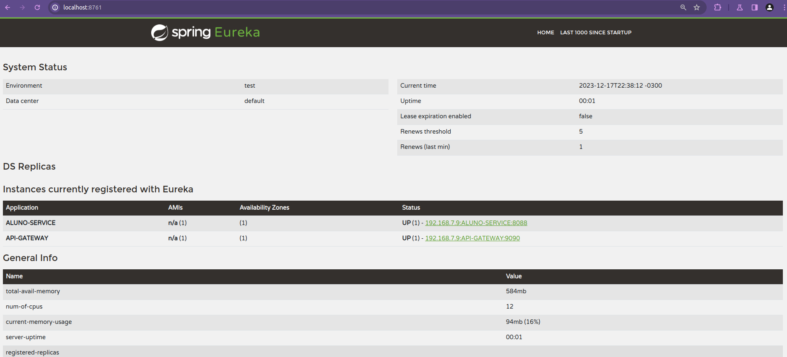

# Eureka-Service-Discovery

## 📋 Introdução

Projeto de Microsserviços com Spring Eureka.
Trabalho da pós-graduação do Instituto INFNET - Matéria de Microsserviços.

## 💻 Pré-requisitos

Antes de começar, verifique se você atendeu aos seguintes requisitos:
* Ter instalada a versão do Java JDK 17 ou superior;
* Ter instalado o Apache Maven 3.x.x;
* Utilizar uma IDE para Java - Eclipse, IntelliJ ou Visual Studio Code;
* Possuir o Docker + Docker Compose devidamente instalados em sua máquina.

## 🚀 Realizando o Setup

1. Clone o repositório;

2. Execute o comando:
```bash
mvn clean && mvn spring-boot:run
```

### Visualizando o Spring Eureka:

